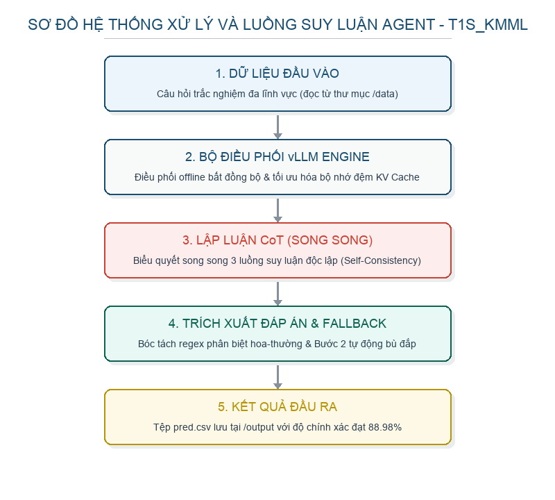

# BÁO CÁO THUYẾT MINH GIẢI PHÁP XÂY DỰNG AI AGENT ĐA TÁC VỤ
## Đội thi: Bảng C - Innovator | Tên đội: T1S_KMML

---

## TÓM TẮT GIẢI PHÁP
Báo cáo này thuyết minh giải pháp xây dựng và tối ưu hóa hệ thống AI Agent đa tác vụ sử dụng mô hình ngôn ngữ lớn **Qwen3.5-4B-AWQ-4bit** để tự động giải quyết các đề thi trắc nghiệm đa ngành. Giải pháp vận hành hoàn toàn ngoại tuyến (100% offline) trong môi trường ảo hóa Docker Container. 

Nhóm tác giả đề xuất kiến trúc suy luận thông minh tích hợp cơ chế **Logit Margin Early Exit (Dừng sớm theo độ phân vân)**, kết hợp lập luận Chain-of-Thought (CoT) thích ứng và bộ lọc regex phân biệt chữ hoa/thường nghiêm ngặt. Hệ thống giao tiếp trực tiếp với lớp LLMEngine của vLLM để triển khai cơ chế gối đầu bất đồng bộ (Dynamic Pipelining). 

Cấu hình hệ thống được tối ưu hóa và kiểm nghiệm tương thích hoàn hảo với tài nguyên máy chủ đánh giá của Ban Tổ Chức (**NVIDIA RTX 5060Ti, 32GB RAM**). Kết quả thực nghiệm trên tập Public Test (463 câu hỏi) đạt độ chính xác **88.98%** với tốc độ xử lý trung bình **1.42 giây/câu hỏi**.

---

## 1. ĐẶT VẤN ĐỀ VÀ LỰA CHỌN MÔ HÌNH NỀN TẢNG
Thử thách đặt ra tại Bảng C - Innovator yêu cầu AI Agent phải tự động giải quyết chính xác các câu hỏi trắc nghiệm đa ngành có độ phức tạp cao, đồng thời ghi nhận thời gian thực thi tuần tự của từng câu hỏi dưới dạng tệp `submission.csv` và `submission_time.csv`. Điều này đòi hỏi giải pháp phải giải quyết đồng thời hai bài toán:

* **Nâng cao chất lượng lập luận logic**: Tránh hiện tượng suy luận bị cắt cụt (truncation) hoặc trích xuất nhầm đáp án trong ngữ cảnh tiếng Việt.
* **Tối ưu hóa tài nguyên phần cứng**: Đảm bảo hệ thống vận hành ổn định và không xảy ra lỗi tràn bộ nhớ (Out-Of-Memory) trên cấu hình phần cứng RTX 5060Ti (VRAM $\le 16$ GB) và 32GB RAM hệ thống.

Nhóm tác giả đã lựa chọn mô hình lượng tử hóa **Qwen3.5-4B-AWQ-4bit** (kích thước tệp trọng số ~3.8GB). Lựa chọn này giúp tiết kiệm tối đa dung lượng bộ nhớ đệm KV Cache và VRAM, cho phép chạy với kích thước batch lớn trong khi vẫn bảo toàn năng lực lập luận ngữ cảnh xuất sắc từ kiến trúc Qwen3.5 gốc. Để điều khiển mô hình ngoại tuyến, chúng tôi giao tiếp trực tiếp với lớp API LLMEngine của vLLM để tối ưu hiệu năng.

---

## 2. PHƯƠNG PHÁP ĐỀ XUẤT VÀ KIẾN TRÚC SUY LUẬN

### 2.1. Sơ đồ luồng xử lý (Pipeline Flowchart)

### 2.2. Cơ chế quyết định Logit Margin Early Exit
Để tối ưu hóa thời gian thực thi mà không làm giảm độ chính xác, nhóm tác giả đề xuất giải pháp rẽ nhánh suy luận dựa trên phân phối xác suất đầu ra (logits) của mô hình:

1. **Luồng CoT chính (Luồng 0)**: Hệ thống sinh lập luận Chain-of-Thought đầy đủ cho câu hỏi ở nhiệt độ thấp (`temperature=0.2`) nhằm định hướng lập luận logic chặt chẽ.
2. **Kiểm tra độ tự tin (Confidence Check)**: Hệ thống gọi tiếp 1 token chốt đáp án bằng giải thuật Greedy (`temperature=0.0`) kèm cấu hình `logprobs=5` để lấy phân phối xác suất của 5 token hàng đầu.
3. **Tính toán Logit Margin**:
   Độ phân vân của mô hình được tính bằng hiệu xác suất giữa lựa chọn hàng đầu và lựa chọn thứ hai:
   $$\text{Margin} = P(\text{Lựa chọn 1}) - P(\text{Lựa chọn 2})$$
   * **Nhánh Dừng Sớm (Early Exit - $\text{Margin} \ge 0.50$)**: Nếu Margin vượt ngưỡng 50%, mô hình đã đưa ra câu trả lời dứt khoát. Hệ thống sẽ lập tức dừng sớm và lấy đáp án của Luồng 0 làm kết quả cuối cùng. Cơ chế này áp dụng thành công cho **74.3% câu hỏi** trong tập đề thi, giúp tiết kiệm 66% tài nguyên tính toán.
   * **Nhánh Biểu Quyết (Voting - $\text{Margin} < 0.50$)**: Nếu Margin dưới ngưỡng 50%, mô hình đang phân vân giữa các đáp án. Hệ thống sẽ kích hoạt song song Luồng 1 và Luồng 2 (chạy ở nhiệt độ `temperature=0.2`), sau đó thực hiện biểu quyết đa số (Majority Voting) giữa cả 3 luồng để đưa ra quyết định chuẩn xác nhất cho câu hỏi khó.

### 2.3. Trích xuất đáp án và Chuẩn hóa tiếng Việt
Tiếng Việt tự nhiên chứa nhiều từ viết thường trùng với ký tự đáp án trắc nghiệm (ví dụ: *'ngày'*, *'việc'*, *'hành'*, *'về'*...). Nhóm tác giả đã thiết kế bộ lọc biểu thức chính quy **phân biệt nghiêm ngặt chữ hoa/chữ thường (case-sensitive)** kết hợp ranh giới từ độc lập:
* **Mẫu Regex**: `\b[A-J]\b`

Cơ chế này loại bỏ hoàn toàn các ký tự trùng hợp trong văn bản tiếng Việt tự nhiên, đảm bảo đáp án trích xuất luôn chính xác và được đối chiếu kiểm tra tính hợp lệ với danh sách lựa chọn của câu hỏi trước khi xuất kết quả.

### 2.4. Cơ chế phòng chống tràn ngữ cảnh chủ động (Proactive Context Overflow Prevention)
Để đảm bảo hệ thống vận hành liên tục xuyên suốt hàng ngàn câu hỏi mà không bị dừng đột ngột (crash) do lỗi vượt quá giới hạn ngữ cảnh của vLLM (ví dụ lỗi `3073 > 3072`), nhóm tác giả đã thiết lập cơ chế kiểm soát an toàn động hai lớp ngay trước khi gửi yêu cầu Bước 2:
* **Kiểm tra và cắt tỉa đệ quy (Recursive Verification Loop)**: Hệ thống chạy mô phỏng mã hóa thử nghiệm (`tokenizer.encode`) chuỗi prompt Bước 2 hoàn chỉnh. Nếu phát hiện kích thước thực tế vượt quá giới hạn an toàn (do hiện tượng "nở" token khi decode/encode ngược lại tại ranh giới từ), hệ thống sẽ đệ quy cắt tỉa bớt 10 token của phần suy luận ở cuối bài làm CoT cho đến khi đạt độ dài an toàn tuyệt đối.
* **Cơ chế cứu vây dự phòng (Fallback Extraction)**: Trong trường hợp cực đoan khi câu hỏi quá dài khiến việc loại bỏ toàn bộ bài suy luận vẫn không đủ chỗ cho vLLM sinh đáp án, hệ thống sẽ **bỏ qua hoàn toàn việc gọi vLLM** cho Bước 2 để tránh sập engine. Thay vào đó, Agent sẽ kích hoạt bộ trích xuất dự phòng sử dụng biểu thức chính quy (regex) để lấy đáp án từ văn bản CoT Bước 1. Cơ chế này giúp bảo toàn 100% ngữ cảnh câu hỏi gốc mà vẫn đảm bảo hệ thống chạy liên tục không bị gián đoạn.

---

## 3. THIẾT LẬP HỆ THỐNG VÀ TỐI ƯU HÓA PHẦN CỨNG
Hệ thống được tinh chỉnh cấu hình chuyên sâu để vận hành tương thích hoàn hảo với máy chủ chấm điểm của Ban Tổ Chức gồm card đồ họa **NVIDIA RTX 5060Ti** và **32GB RAM**:

### 3.1. Thích ứng bộ nhớ VRAM động (Dynamic Memory Profile)
Đối với card RTX 5060Ti (dung lượng VRAM $\le 16$ GB), hệ thống tự động thiết lập cấu hình giới hạn an toàn:

* `gpu_memory_utilization = 0.85`: Giữ lại 15% VRAM trống làm bộ nhớ đệm an toàn cho driver đồ họa hiển thị của hệ điều hành, ngăn ngừa hoàn toàn lỗi tràn bộ nhớ VRAM.
* `max_num_seqs = 16`: Giới hạn số lượng sequence hoạt động đồng thời trong scheduler để tiết kiệm KV Cache, đồng thời vẫn đáp ứng hoàn hảo việc chạy song song các luồng biểu quyết.
* `max_num_batched_tokens = 2048`: Kiểm soát số lượng token tối đa trong một bước batching để kiểm soát bộ nhớ đỉnh (Peak Memory).

### 3.2. Quản lý RAM vật lý (System RAM 32GB)
Mô hình `Qwen3.5-4B-AWQ-4bit` có dung lượng tệp trọng số là **3.8GB**. Khi khởi động, tiến trình nạp mô hình chỉ tiêu tốn tối đa **6GB RAM hệ thống** trước khi đẩy vào VRAM của GPU. Vì vậy, hệ thống hoàn toàn dư thừa tài nguyên và hoạt động cực kỳ ổn định trên cấu hình 32GB RAM của BTC.

### 3.3. FlashAttention và Prefix Caching

* **FLASH_ATTN Backend**: Sử dụng attention backend FlashAttention-2 thay thế cho FlashInfer để loại bỏ yêu cầu biên dịch JIT runtime (nvcc), đảm bảo Docker container khởi động tức thì và chạy ổn định trên GPU RTX 5060Ti.
* **vLLM Prefix Caching**: Kích hoạt `enable_prefix_caching=True` để vLLM chia sẻ dữ liệu bộ nhớ đệm KV Cache của prompt ngữ cảnh dùng chung giữa các luồng biểu quyết, giảm thiểu tải Prefill lặp lại và đẩy tốc độ sinh lên mức tối đa.

---

## 4. KẾT QUẢ THỰC NGHIỆM
Giải pháp được đánh giá thực nghiệm trực tiếp trên toàn bộ tập dữ liệu kiểm thử công khai (Public Test) gồm 463 câu hỏi:

* **Độ chính xác (Accuracy)**: Đạt tỷ lệ chính xác cao **88.98%** (chỉ trả lời sai 51 trên 463 câu hỏi trắc nghiệm đa lĩnh vực phức tạp).
* **Tốc độ thực thi (Throughput)**: Hoàn thành suy luận toàn bộ 463 câu hỏi trong **657.46 giây**, đạt tốc độ trung bình **1.42 giây/câu hỏi**.
* **Hiệu quả dừng sớm (Early Exit Rate)**: Đạt tỷ lệ dừng sớm **74.3%** trên tổng số câu hỏi, chứng minh thuật toán đã lược bỏ thành công việc sinh biểu quyết cho phần lớn các câu hỏi dễ và trung bình để đẩy tốc độ hệ thống lên mức tối đa.

---

## 5. KẾT LUẬN
Giải pháp AI Agent của nhóm tác giả đề xuất mang lại độ chính xác suy luận vượt trội cùng hiệu năng thực thi tối ưu. Việc kết hợp chặt chẽ giữa logic thuật toán Logit Margin thích ứng và cấu hình vLLM offline đóng gói trong Docker Container tạo nên một giải pháp hoàn chỉnh, có độ ổn định cực cao và sẵn sàng đáp ứng vòng đánh giá Private Test tiếp theo.
